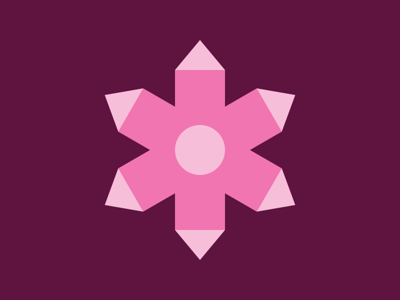

# Battle #197 - Crystal

## Recreate this target (400px x 300px)



[https://cssbattle.dev/play/197](https://cssbattle.dev/play/197)

## My Solution

Score: 597.35	{424}	#90

```html
<body bgColor=5F133F><p><p i><p j><p k><p l><p m><style>*,*:before,*:after{width:50;position:absolute}p{top:46;left:167;height:80;background:#F075B0;transform-origin:bottom}p:before{top:-30;height:30;clip-path:polygon(50% 0,100% 100%,0 100%)}p:after{height:50;border-radius:50%;bottom:-25}p:before,p:after{content:'';background:#F7BED9}[i]{rotate:60deg}[j]{rotate:120deg}[k]{rotate:180deg}[l]{rotate:240deg}[m]{rotate:300deg
```
